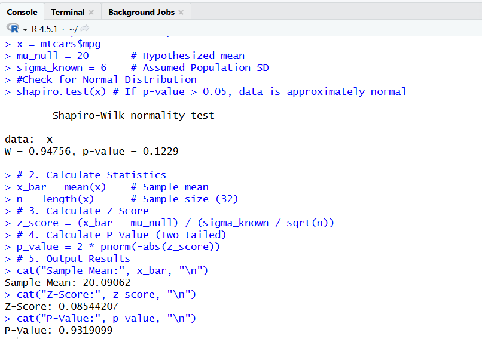
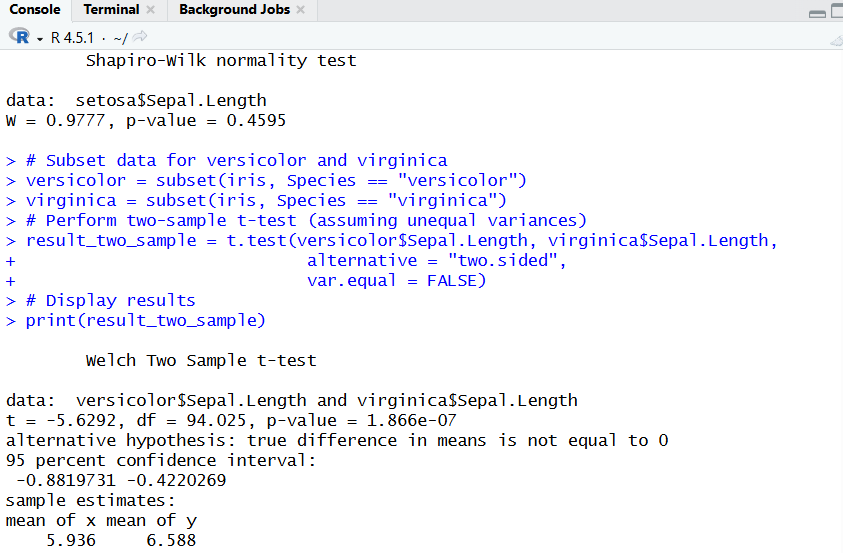
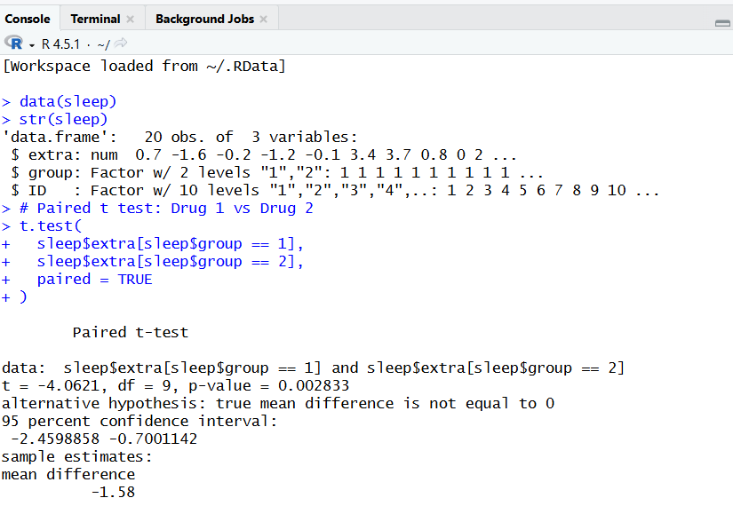
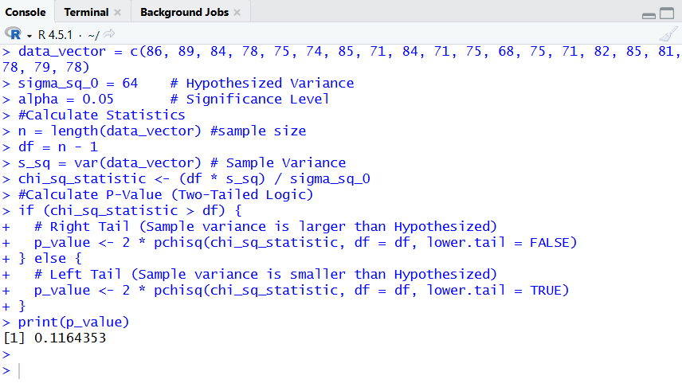
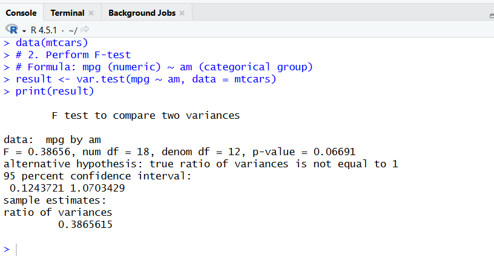
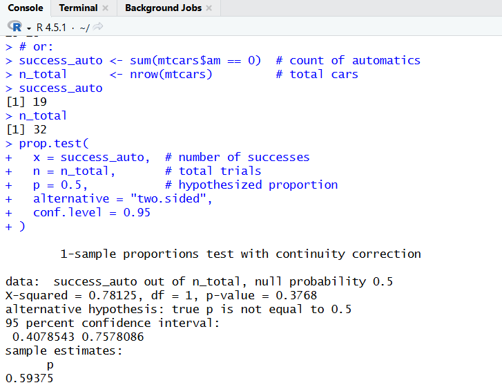
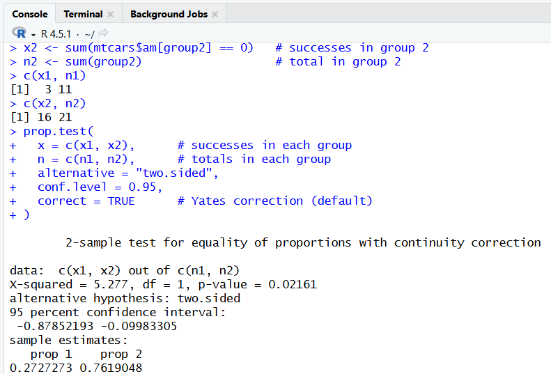
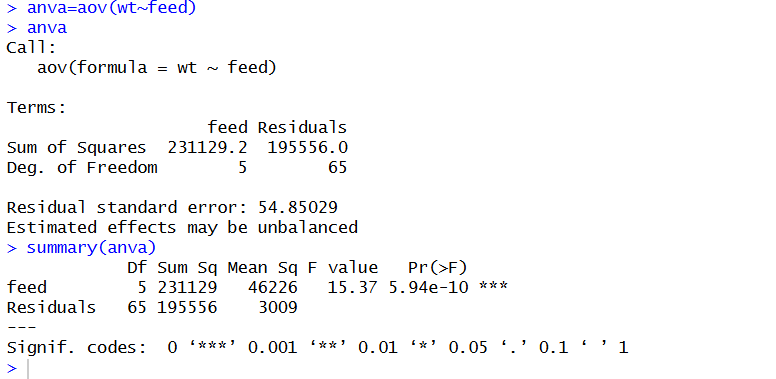
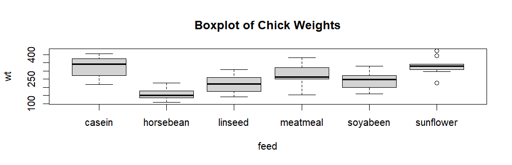
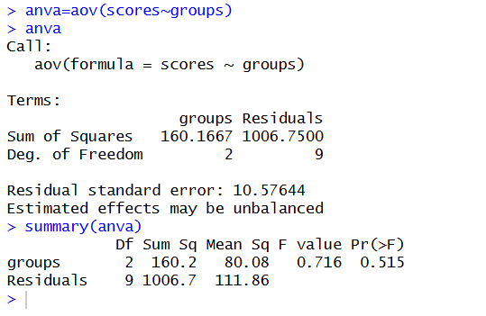

# Introduction-to-R

# R Programming & Statistical Analysis Portfolio

This repository contains a comprehensive collection of R programming lab reports and practical components, ranging from basic vector/matrix operations to advanced hypothesis testing.

---

## 📂 Part 1: Foundations & Practical Components

<strong>Lab 1: Vector/Matrix Operations & Sampling Error (mtcars)</strong>

### 1. Overview
* **Dataset:** `mtcars`
* **Objective:** Perform vector/matrix arithmetic and calculate Sampling/Standard Error for different sample sizes.

### 2. Methodology & Code
* **Vector Ops:** Addition, subtraction, multiplication, and division of random samples.
* **Matrix Ops:** Creation of $2 \times 2$ and $3 \times 3$ matrices, element-wise multiplication vs. matrix multiplication (`%*%`).
* **Error Calculation:**
    * *Sampling Error:* $Z \times \frac{\sigma}{\sqrt{n}}$
    * *Standard Error:* $\frac{s}{\sqrt{n}}$

### 3. Results

> **Interpretation:**
> * The Sampling Error remained constant (0.724) as both samples had $n=7$.
> * **Sample 1** had a lower Standard Error (0.202), making it more representative than **Sample 2** (SE = 0.287).

<strong>CIA Component: Matrix & Error Analysis (Pressure Dataset)</strong>

### 1. Data Description
* **Dataset:** `pressure` (Variable: `pressure` column).
* **Tasks:**
    1. Create $3 \times 3$ matrices for the first 9 and last 9 observations.
    2. Analyze Sampling Error across increasing sample sizes ($n=10, 15, 18$).

### 2. Results
* **Matrix Multiplication ($M_1 \times M_2$):** Performed on subsets of the data.
* **Error Analysis by Sample Size:**

| Sample Size (n) | Sampling Error | Standard Error |
| :--- | :--- | :--- |
| **n = 10** | 139.22 | 60.32 |
| **n = 15** | 113.67 | 56.79 |
| **n = 18** | 103.77 | 54.45 |

> **Conclusion:**
> As sample size increases, both Sampling Error and Standard Error **decrease**. Sample 3 ($n=18$) is the most statistically stable.

---

## 📂 Part 2: Statistical Hypothesis Testing

<strong>Lab 2: Z-Test (One Sample)</strong>

* **Test:** Z-test for population mean.
* **Dataset:** `mtcars` (mpg).
* **Hypothesis:** $H_0: \mu = 20$ (with $\sigma=6$).
* **Result:** P-value = 0.9319.
* **Decision:** Fail to reject $H_0$. The fuel efficiency is consistent with 20 mpg.
    

<strong>Lab 3: One-Sample t-Test</strong>

* **Test:** t-test for population mean (unknown $\sigma$).
* **Dataset:** `iris` (setosa sepal length).
* **Hypothesis:** $H_0: \mu = 5.0$.
* **Result:** P-value = 0.9047.
* **Decision:** Fail to reject $H_0$. Setosa sepal length averages approximately 5.0 cm.

<strong>Lab 4: Two-Sample Independent t-Test</strong>

* **Test:** Welch Two Sample t-test.
* **Dataset:** `iris` (Versicolor vs. Virginica).
* **Hypothesis:** $H_0: \mu_1 = \mu_2$.
* **Result:** P-value = $1.866 \times 10^{-7}$.
* **Decision:** **Reject $H_0$.** Virginica has a significantly larger average sepal length.

<strong>Lab 5: Paired t-Test</strong>

* **Test:** Paired t-test (Dependent samples).
* **Dataset:** `sleep` (Drug 1 vs. Drug 2 on same patients).
* **Hypothesis:** $H_0: \mu_{diff} = 0$.
* **Result:** P-value = 0.0028.
* **Decision:** **Reject $H_0$.** Drug 2 is significantly more effective, providing ~1.58 hours more sleep.

<strong>Lab 6: Chi-Square Test for Variance</strong>

* **Test:** Test for single variance.
* **Hypothesis:** $H_0: \sigma^2 = 64$.
* **Result:** P-value = 0.1164.
* **Decision:** Fail to reject $H_0$. The variability is statistically compatible with 64.

<strong>Lab 7: F-Test for Two Variances</strong>

* **Test:** F-test to compare two variances.
* **Dataset:** `mtcars` (Automatic vs. Manual mpg).
* **Hypothesis:** $H_0: \sigma_1^2 = \sigma_2^2$.
* **Result:** P-value = 0.0669.
* **Decision:** Fail to reject $H_0$. No significant difference in mpg variability between transmission types.

<strong>Lab 8: Single and Two Proportions Tests</strong>

* **One-Sample:** Test if Automatic cars = 50% ($p=0.5$).
    * *Result:* P-value = 0.3768. Fail to reject $H_0$.
      

* **Two-Sample:** Compare Automatic proportion in 4-cyl vs. 6/8-cyl cars.
    * *Result:* P-value = 0.02161. **Reject $H_0$.**
    * *Interpretation:* 6/8-cylinder cars are significantly more likely to have automatic transmission.
      

<strong>Lab 9a: One-Way ANOVA (Chick Weights)</strong>

### 1. Data Description
* **Dataset:** Custom vectors representing chick weights fed on different diets.  

Newly hatched chicks were randomly allocated Into six groups, and each group was given a different feed supplement. Their weights in grams after six weeks are given below along with feed types.
   * horsebean: 179 160 136 227 217 168 108 124 143 140
   * linseed: 309 229 181 141 260 203 148 169 213 257 244 271
   * soybean: 243 230 248 327 329 250 193 271 316 267 199 171 158 248
   * sunflower: 423 340 392 339 341 226 320 295 334 322 297 318
   * meat-meal: 325 257 303 315 380 153 263 242 206 344 258
   * casein: 368 390 379 260 404 318 352 359 216 222 283 332  

Compare the effectiveness of various feed supplements on the growth rate of chickens using an appropriate statistical test at 5% level of significance. Check for the model assumptions. Carryout pairwise comparisions to tease out the source of significant difference. Draw your conclusions.

* **Groups (Feeds):** Horsebean, Linseed, Soyabeen, Sunflower, Meatmeal, Casein.
* **Objective:** Compare the effect of 6 different feed types on chick weight.

### 2. Methodology
* **Test:** One-Way Analysis of Variance (ANOVA).
* **Hypothesis:** * $H_0$: All feed types result in the same mean weight ($\mu_1 = \mu_2 = ... = \mu_6$).
    * $H_1$: At least one feed type results in a different mean weight.
* **Visualization:** Boxplot generated to visually compare medians.

### 3. Results
* **F-statistic:** 15.37
* **Degrees of Freedom:** 5 (between groups), 65 (residuals)
* **P-value:** $5.94 \times 10^{-10}$ (indicated as `***`)

### 4. Decision
Since $p = 5.94 \times 10^{-10} < 0.05$, we **reject the Null Hypothesis ($H_0$)**.

### 5. Interpretation
* There is a statistically significant difference in chick weights depending on the feed type provided.
* **Boxplot Analysis:** The visual data suggests that **Casein** results in the highest median weight, while **Horsebean** results in the lowest. The other feeds cluster in the middle.

<strong>Lab 9b: One-Way ANOVA (Batch Scores)</strong>

### 1. Data Description
* **Dataset:** Exam scores from three different batches.
    * **Batch A:** `c(24, 40, 32)`
    * **Batch B:** `c(15, 29, 42, 41, 33)`
    * **Batch C:** `c(11, 22, 39, 25)`
* **Objective:** Determine if the mean scores differ significantly between the three batches.

### 2. Methodology
* **Test:** One-Way Analysis of Variance (ANOVA).
* **Hypothesis:**
    * $H_0$: $\mu_A = \mu_B = \mu_C$ (All batches have equal performance).
    * $H_1$: At least one batch differs.

### 3. Results
* **F-statistic:** 0.716
* **Degrees of Freedom:** 2 (between groups), 9 (residuals)
* **P-value:** 0.515

### 4. Decision
Since $p = 0.515 > 0.05$, we **fail to reject the Null Hypothesis ($H_0$)**.

### 5. Interpretation
* There is **no statistically significant difference** in the average scores between Batch A, Batch B, and Batch C.
* The observed differences in means are likely due to random chance rather than any fundamental difference in the batches.

